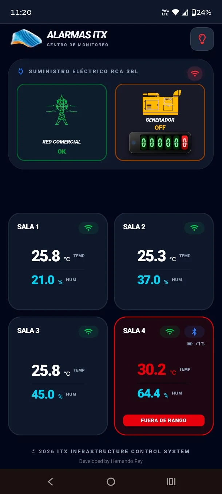
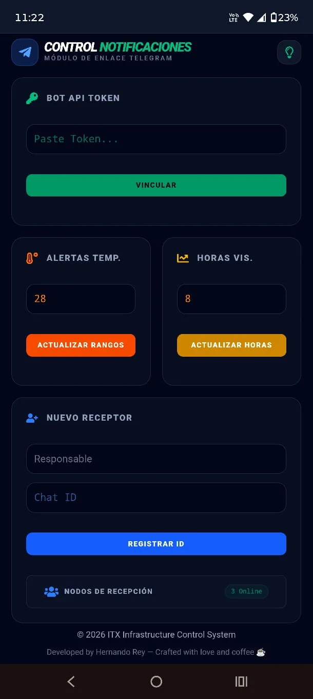
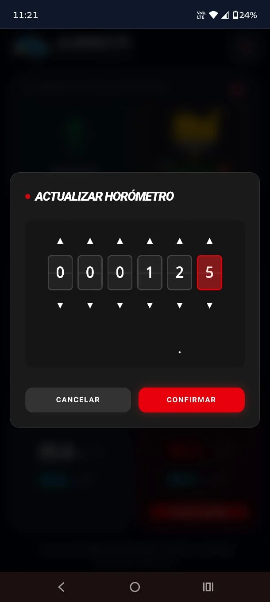
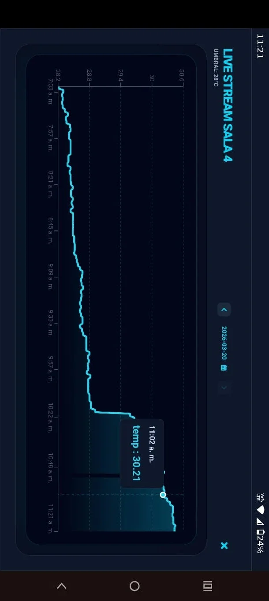

# ⚡ ALARMAS ITX | Infrastructure Control System

**Alarmas ITX** es una plataforma de monitoreo crítico de última generación diseñada para la supervisión en tiempo real de infraestructura de telecomunicaciones. Con una interfaz de estética **Cyberpunk** y colores neón, el sistema garantiza la integridad térmica y energética de 4 salas técnicas mediante una arquitectura robusta de IoT y Cloud Computing.

> [!IMPORTANT]
> **Live Demo:** Accede a la aplicación en tiempo real aquí: [https://alarmas-itx.web.app/](https://alarmas-itx.web.app/)

---

## 📸 Visual Stack (Preview)

> [!TIP]
> La interfaz utiliza efectos de cristal (Glassmorphism), bordes neón vibrantes y un modo oscuro profundo para una visualización técnica de alto impacto.

| Dashboard | Configuración & Alertas | Actualizar Horómetro | Gráficas en Tiempo Real |
| :--- | :--- | :--- | :--- |
|  |  |  |  |

---

## 🛠️ Hardware & Ecosistema IoT

El sistema recolecta datos de una red mixta de sensores inteligentes:
* **Sensores Locales:** ESP32 D1 Mini con **DHT11** o **SHT30**.
* **Sensores Bluetooth:** Xiaomi Mi Temperature & Humidity Monitor 2 (**LYWSD03MMC**) flasheados con firmware **BTHome**.
* **Gateways / Proxies:** ESP32 C6, WT32-ETH (Ethernet) y ESP32 básicos actuando como puentes Bluetooth para la nube.
* **Monitoreo Eléctrico:** Sensor basado en ESP32 para detectar el estado de la red comercial (AC) y el encendido del generador.

👉 **[Acceder al Repositorio de Configuración YAML (Sensores)](https://github.com/hrking31/EspHomeRey/tree/main/AlarmasItx)**

---

## 🚀 Características Principales

### 🖥️ Dashboard de Monitoreo
* **Real-Time Data:** Visualización instantánea de temperatura y humedad de las 4 salas.
* **Estado de Conexión:** Indicadores visuales de salud para los sensores, proxies BT y niveles de batería de los dispositivos inalámbricos.
* **Gestión Energética:** Monitor de suministro AC y estado del Generador con **Horómetro integrado** (conteo de horas de uso).

### 📈 Análisis de Datos
* **Gráficas Dinámicas:** Selector de rango desde 1 hora hasta 24 horas en la vista principal.
* **Vista Detallada:** Acceso a gráficas a pantalla completa (12:00 AM - 11:59 PM) al hacer clic en cualquier sala.
* **Historial Extendido:** Navegador de datos históricos de hasta **60 días** mediante un selector de fecha inteligente.

### ⚙️ Configuración Avanzada
* **Gestión de Notificaciones:** Edición de Token de Telegram y administración de IDs de receptores.
* **Control de Umbrales:** Ajuste de límites críticos de temperatura y personalización de la vista de gráficas.
* **Seguridad:** Sistema de Login, recuperación de cuenta y lista de usuarios conectados en tiempo real.

---

## 🧠 Backend Logic: Firebase Cloud Functions

El núcleo del sistema reside en 5 funciones automatizadas que procesan la telemetría y gestionan la persistencia:

1.  **`notificarTemperatura`**: Monitorea el nodo `/sensores/` en la RTDB. Si la temperatura supera el umbral configurado, envía una alerta crítica a Telegram y cambia el estado de la sala a "Alta". Se encarga también de notificar cuando la temperatura vuelve a la normalidad.
2.  **`notificarEnergia`**: Escucha cambios en el suministro eléctrico. Informa inmediatamente si hay un corte de energía comercial o si el generador ha sido activado/apagado, manteniendo un registro del estado anterior para evitar duplicados.
3.  **`verificarConexionSensores`**: Un scheduler que corre cada **5 minutos**. Compara el *timestamp* del último reporte de cada ESP32 contra la hora actual. Si el retraso supera los 2 minutos, marca el dispositivo como offline y dispara una alerta de desconexión.
4.  **`respaldarHistorialDiario`**: Se ejecuta al final de cada día para optimizar el almacenamiento. Toma todos los puntos de datos de la RTDB, los ordena y los compacta en un solo documento de **Firestore**, garantizando que las consultas históricas sean ultra rápidas.
5.  **`limpiarGraficaHistorica`**: Tarea de mantenimiento diario a las 3:00 AM. Borra los datos del día anterior de la RTDB (una vez respaldados) y elimina los registros de Firestore que tienen más de **60 días** para mantener el sistema eficiente y libre de basura.

---

## 📦 Tecnologías Utilizadas

* **Frontend:** React.js, Tailwind CSS (Custom Neon Theme), Framer Motion.
* **Backend:** Firebase Cloud Functions (Node.js).
* **Base de Datos:** Realtime Database (Estado vivo) & Firestore (Históricos).
* **Autenticación:** Firebase Auth.
* **Notificaciones:** Telegram Bot API.

---

© 2026 Developed by Hernando Rey — Crafted with love and coffee ☕.
*"In code we trust, in sensors we monitor."*
