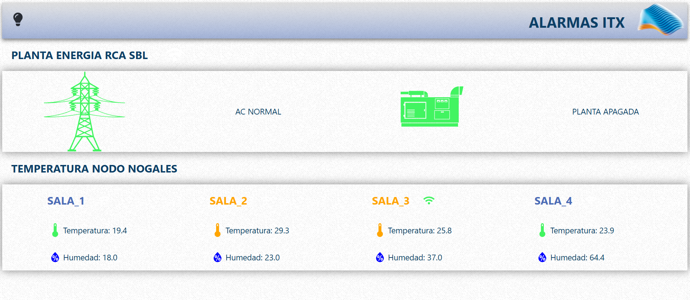
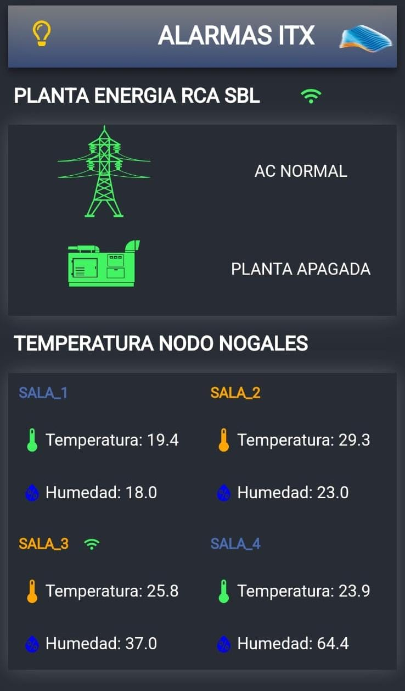

# **Monitorización en Tiempo Real de Sensores con React y ESP32**  

## **Descripción**  
Este proyecto es una aplicación web desarrollada en **React** para la monitorización en tiempo real del estado de un **generador eléctrico**, la **energía comercial** y la **temperatura** de cuatro salas de equipos de telecomunicaciones.  

Los datos se capturan mediante **ESP32 (Wemos Mini)** con sensores de temperatura y **relé de potencia de 8 pines** para detectar el estado del generador y la energía comercial. La información se envía a **Firebase Realtime Database**, desde donde la app React los lee y visualiza en tiempo real.  

## **Características**  
✅ Monitorización en tiempo real de sensores  
✅ Lectura del estado del generador eléctrico y la energía comercial  
✅ Medición de temperatura en cuatro salas de telecomunicaciones  
✅ Uso de **ESP32 (Wemos Mini)** para la recolección de datos  
✅ Conexión con **Firebase Realtime Database**  
✅ Interfaz web desarrollada en **React**  

## **Tecnologías Utilizadas**  
- **Frontend:** React, CSS, JavaScript
- **Backend:** Firebase Realtime Database  
- **Hardware:** ESP32 (Wemos Mini), sensores de temperatura y humedad DHT11, relés de potencia  
- **Comunicación:** Wi-Fi (ESP32 → Firebase)  

## **Instalación y Configuración**  

### **1. Clonar el repositorio**  
```bash
https://github.com/hrking31/alarmas_itx.git
```

### **2. Instalar dependencias**  
```bash
npm install
```

### **3. Configurar Firebase**  
https://firebase.google.com/docs/web/setup?hl=es-419
- Crear un proyecto en **Firebase**  
- Habilitar **Firebase Realtime Database**  
- Configurar las reglas de lectura/escritura  
- Agregar el archivo `FirebaseConfig.js` en src con las credenciales de Firebase
  

Ejemplo de `FirebaseConfig.js`:  
```FirebaseConfig.js
apiKey: tu_api_key
authDomain: tu_auth_domain
projectId: tu_project_id
storageBucket: u_storage_bucket
messagingSenderId: tu_messaging_sender_id
appId: tu_app_id
```

### **4. Ejecutar la aplicación**  
```bash
npm run dev
```

La aplicación estará disponible en:  
```
http://localhost:5173/
```

## **Uso del ESP32**  
El **ESP32 (Wemos Mini)** está programado en **Arduino IDE** y se encarga de:  
- Leer la temperatura de los sensores  
- Detectar el estado del generador y la energía comercial con relés de potencia  
- Enviar los datos a **Firebase Realtime Database**  

### **Código ESP32 - (Arduino)**  
```cpp
#include <WiFi.h>
#include <FirebaseESP32.h>

#define FIREBASE_HOST "tu-database.firebaseio.com"
#define FIREBASE_AUTH "tu-auth-token"

const char* ssid = "tu_red_wifi";
const char* password = "tu_contraseña";

FirebaseData firebaseData;

void setup() {
    Serial.begin(115200);
    WiFi.begin(ssid, password);
    
    while (WiFi.status() != WL_CONNECTED) {
        delay(1000);
        Serial.println("Conectando...");
    }

    Firebase.begin(FIREBASE_HOST, FIREBASE_AUTH);
    Firebase.reconnectWiFi(true);
}

void loop() {
    int temperatura = analogRead(34);  
    bool generadorEstado = digitalRead(5);  
    bool energiaEstado = digitalRead(4);  

    Firebase.setInt(firebaseData, "/sensores/temperatura", temperatura);
    Firebase.setBool(firebaseData, "/sensores/generador", generadorEstado);
    Firebase.setBool(firebaseData, "/sensores/energia", energiaEstado);

    delay(5000);
}
```

## 📸 Capturas de pantalla

### Vista PC


### Vista Movil


## **Contribuciones**  
Si quieres contribuir al proyecto, ¡eres bienvenido! Puedes hacer un **fork**, crear una nueva rama y enviar un **pull request**.  

## **Licencia**  
Este proyecto está bajo la licencia **MIT**.  
